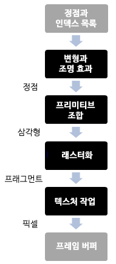
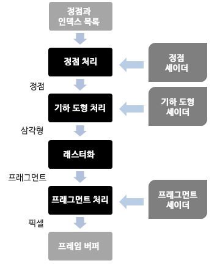

# 렌더링

이 장에서는 OpenGL을 활용하여 화면을 렌더링하는 방법에 대해 배웁니다. 고정기능 파이프라인을 사용하는 OpenGL의 과거 버전에 익숙하시다면, 이 장이 끝날 즈음엔 왜 이렇게 복잡하게 만들어야 하는지에 대해 의문이 생길지도 모릅니다. 왜 간단한 도형 하나를 그리는데 이렇게나 많은 개념들과 긴 코드를 써야 하는지 이해가 되지 않을겁니다. 그러나 한 번 써보면 오히려 이게 더 간단하고 유연한 코드라는 걸 알 수 있을 겁니다. 최신 버전의 OpenGL에서는 문제 각각에 대해 따로따로 생각할 수 있으며 코드를 보기 쉽게 정리하고 더 논리적으로 처리할 수 있습니다.

3D로 구현된 것을 2D 화면에 출력하기까지의 일련의 과정을 그래픽 파이프라인이라 부릅니다. OpenGL의 초기 버전에서는 고정기능 파이프라인이란 모형을 사용하였습니다. 그 모형에서는 렌더링 과정에서 고정된 단계의 작업을 진행하였습니다. 프로그래머들은 각 단계별로 사용 가능한 함수들을 정해야만 하였습니다. 이 때문에 결과물과 작업은 API에 의해 한정될 수밖에 없었습니다. \(예를 들면, “안개 설정” 또는 “광원 추가”가 있습니다. 그 함수들의 동작은 고정되어 있어 수정이 불가능합니다\).

그래픽 파이프라인은 이러한 단계로 구성됩니다:



OpenGL 2.0버전은 프로그래밍 가능한 파이프라인을 선보입니다. 이 모형에서는 그래픽 파이프라인을 구성하는 각 단계들을 '셰이더'라 불리는 프로그램을 사용하여 수정이 가능합니다. 다음 그림은 OpenGL의 프로그래밍 가능한 파이프라인을 간략하게 보여주고 있습니다.



렌더링은 정점 버퍼의 형태로 정점들의 리스트를 받아 오는 것에서 시작합니다. 근데, 정점이 뭘까요? 정점은 2차원 또는 3차원 내의 한 점을 나타내는 자료구조입니다. 3차원 공간에서 점을 나타내려면 x, y, z좌표를 특정하면 되겠죠? 그렇다면 정점 버퍼란 무엇일까요? 정점 버퍼는 정점 배열을 사용하여 렌더링해야할 모든 정점들을 묶는 자료구조입니다. 그래픽 파이프라인 내에서 셰이더를 통해 정점들의 정보를 얻을 수 있게 해주죠.

정점들은 정점 셰이더를 통해 처리됩니다. 정점 셰이더의 주 목적은 화면에서 각 정점의 투영된 위치를 계산하는 겁니다. 이 셰이더로 색이나 질감 등에 관련된 다른 출력도 가능하지만, 일반적으론 화면에 정점들을 투영시키는 데 사용되죠. 다른 말로 하면, 점을 찍는다는 겁니다.

기하 도형 처리 과정에서는 정점 셰이더를 통해 변형된 정점들을 삼각형의 형태로 만듭니다. 이 과정에서는 정점들이 저장되어 있는 순서를 고려하여 그들을 서로 다른 모델을 사용하여 묶는 방식을 사용합니다. 왜 하필 삼각형일까요? 삼각형은 그래픽 카드가 처리하는 가장 기본적인 단위 비슷한 겁니다. 삼각형은 간단한 도형임에도 서로 합치고 변형하면 복잡한 3차원 화면을 표현할 수 있습니다. 이 단계에서도 정점들을 묶기 위해 셰이더를 사용할 수 있습니다.

래스터화 단계에서는 전 단계에서 만들었던 삼각형들을 잘라내고 변형해서 픽셀 사이즈의 프래그먼트로 만듭니다.

이 프래그먼트들은 프래그먼트 처리 단계에서  프래그먼트 셰이더를 통해 사용됩니다. 프래그먼트 셰이더는 픽셀을 생성하고 프레임버퍼에 쓰여질 색을 최종적으로 할당합니다. 프레임버퍼는 그래픽 파이프라인의 최종단계입니다. 화면에 표현될 각 픽셀의 정보를 담고 있죠.

3D 카드는 위에서 설명한 모든 작업을 병렬적으로 처리할 수 있게 설계되어 있다는 걸 알아두세요. 최종 화면을 보여주기 위해서 입력된 정보는 병렬적으로 처리될 수 있습니다.

그렇다면 첫 셰이더 프로그램을 작성해 보도록 합시다. 셰이더는 ANSI C 기반의 GLSL \(OpenGL Shading Language\)을 사용하여 제작되어 있습니다.
일단 resources 폴더에 “`vertex.vs`” \(정점(vertex) 셰이더용\)라는 파일을 만들어 다음 내용을 적어줍시다.
```
#version 330

layout (location=0) in vec3 position;

void main()
{
    gl_Position = vec4(position, 1.0);
}
```

The first line is a directive that states the version of the GLSL language we are using. The following table relates the GLSL version, the OpenGL that matches that version and the directive to use \(Wikipedia: [https://en.wikipedia.org/wiki/OpenGL\_Shading\_Language\#Versions](https://en.wikipedia.org/wiki/OpenGL_Shading_Language#Versions)\).

| GLS Version | OpenGL Version | Shader Preprocessor |
| --- | --- | --- |
| 1.10.59 | 2.0 | \#version 110 |
| 1.20.8 | 2.1 | \#version 120 |
| 1.30.10 | 3.0 | \#version 130 |
| 1.40.08 | 3.1 | \#version 140 |
| 1.50.11 | 3.2 | \#version 150 |
| 3.30.6 | 3.3 | \#version 330 |
| 4.00.9 | 4.0 | \#version 400 |
| 4.10.6 | 4.1 | \#version 410 |
| 4.20.11 | 4.2 | \#version 420 |
| 4.30.8 | 4.3 | \#version 430 |
| 4.40 | 4.4 | \#version 440 |
| 4.50 | 4.5 | \#version 450 |

The second line specifies the input format for this shader. Data in an OpenGL buffer can be whatever we want, that is, the language does not force you to pass a specific data structure with a predefined semantic. From the point of view of the shader it is expecting to receive a buffer with data. It can be a position, a position with some additional information or whatever we want. The vertex shader is just receiving an array of floats. When we fill the buffer, we define the buffer chunks that are going to be processed by the shader.

So, first we need to get that chunk into something that’s meaningful to us. In this case we are saying that, starting from the position 0, we are expecting to receive a vector composed of 3 attributes \(x, y, z\).

The shader has a main block like any other C program which in this case is very simple. It is just returning the received position in the output variable `gl_Position` without applying any transformation. You now may be wondering why the vector of three attributes has been converted into a vector of four attributes \(vec4\). This is because `gl_Position` is expecting the result in vec4 format since it is using homogeneous coordinates. That is, it’s expecting something in the form \(x, y, z, w\), where w represents an extra dimension. Why add another dimension? In later chapters you will see that most of the operations we need to do are based on vectors and matrices. Some of those operations cannot be combined if we do not have that extra dimension. For instance we could not combine rotation and translation operations. \(If you want to learn more on this, this extra dimension allow us to combine affine and linear transformations. You can learn more about this by reading the excellent book “3D Math Primer for Graphics and Game development, by Fletcher Dunn and Ian Parberry\).

Let us now have a look at our first fragment shader. We will create a file named “`fragment.fs`” \(The extension is for Fragment Shader\) under the resources directory with the following content:

```
#version 330

out vec4 fragColor;

void main()
{
    fragColor = vec4(0.0, 0.5, 0.5, 1.0);
}
```

The structure is quite similar to our vertex shader. In this case we will set a fixed colour for each fragment. The output variable is defined in the second line and set as a vec4 fragColor.  
Now that we have our shaders created, how do we use them? This is the sequence of steps we need to follow:  
1.    Create a OpenGL Program  
2.    Load the vertex and fragment shader code files.  
3.    For each shader, create a new shader program and specify its type \(vertex, fragment\).  
4.    Compile the shader.  
5.    Attach the shader to the program.  
6.    Link the program.

At the end the shader will be loaded in the graphics card and we can use it by referencing an identifier, the program identifier.

```java
package org.lwjglb.engine.graph;

import static org.lwjgl.opengl.GL20.*;

public class ShaderProgram {

    private final int programId;

    private int vertexShaderId;

    private int fragmentShaderId;

    public ShaderProgram() throws Exception {
        programId = glCreateProgram();
        if (programId == 0) {
            throw new Exception("Could not create Shader");
        }
    }

    public void createVertexShader(String shaderCode) throws Exception {
        vertexShaderId = createShader(shaderCode, GL_VERTEX_SHADER);
    }

    public void createFragmentShader(String shaderCode) throws Exception {
        fragmentShaderId = createShader(shaderCode, GL_FRAGMENT_SHADER);
    }

    protected int createShader(String shaderCode, int shaderType) throws Exception {
        int shaderId = glCreateShader(shaderType);
        if (shaderId == 0) {
            throw new Exception("Error creating shader. Type: " + shaderType);
        }

        glShaderSource(shaderId, shaderCode);
        glCompileShader(shaderId);

        if (glGetShaderi(shaderId, GL_COMPILE_STATUS) == 0) {
            throw new Exception("Error compiling Shader code: " + glGetShaderInfoLog(shaderId, 1024));
        }

        glAttachShader(programId, shaderId);

        return shaderId;
    }

    public void link() throws Exception {
        glLinkProgram(programId);
        if (glGetProgrami(programId, GL_LINK_STATUS) == 0) {
            throw new Exception("Error linking Shader code: " + glGetProgramInfoLog(programId, 1024));
        }

        if (vertexShaderId != 0) {
            glDetachShader(programId, vertexShaderId);
        }
        if (fragmentShaderId != 0) {
            glDetachShader(programId, fragmentShaderId);
        }

        glValidateProgram(programId);
        if (glGetProgrami(programId, GL_VALIDATE_STATUS) == 0) {
            System.err.println("Warning validating Shader code: " + glGetProgramInfoLog(programId, 1024));
        }

    }

    public void bind() {
        glUseProgram(programId);
    }

    public void unbind() {
        glUseProgram(0);
    }

    public void cleanup() {
        unbind();
        if (programId != 0) {
            glDeleteProgram(programId);
        }
    }
}
```

The constructor of the `ShaderProgram` creates a new program in OpenGL and provides methods to add vertex and fragment shaders. Those shaders are compiled and attached to the OpenGL program. When all shaders are attached the link method should be invoked which links all the code and verifies that everything has been done correctly.

Once the shader program has been linked, the compiled vertex and fragment shaders can be freed up \(by calling `glDetachShader`\)

Regarding verification, this is done through the `glValidateProgram` call. This method is used mainly for debugging purposes, and it should be removed when your game reaches production stage. This method tries to validate if the shader is correct given the **current OpenGL state**. This means, that validation may fail in some cases even if the shader is correct, due to the fact that the current state is not complete enough to run the shader \(some data may have not been uploaded yet\). So, instead of failing, we just print an error message to the standard error output.

`ShaderProgram` also provides methods to activate this program for rendering \(bind\) and to stop using it \(unbind\). Finally it provides a cleanup method to free all the resources when they are no longer needed.

Since we have a cleanup method, let us change our `IGameLogic` interface class to add a cleanup method:

```java
void cleanup();
```

This method will be invoked when the game loop finishes, so we need to modify the run method of the `GameEngine` class:

```java
@Override
public void run() {
    try {
        init();
        gameLoop();
    } catch (Exception excp) {
        excp.printStackTrace();
    } finally {
        cleanup();
    }
}
```

Now we can use our shaders in order to display a triangle. We will do this in the `init` method of our `Renderer` class. First of all, we create the shader program:

```java
public void init() throws Exception {
    shaderProgram = new ShaderProgram();
    shaderProgram.createVertexShader(Utils.loadResource("/vertex.vs"));
    shaderProgram.createFragmentShader(Utils.loadResource("/fragment.fs"));
    shaderProgram.link();
}
```

We have created a utility class which by now provides a method to retrieve the contents of a file from the class path. This method is used to retrieve the contents of our shaders.

Now we can define our triangle as an array of floats. We create a single float array which will define the vertices of the triangle. As you can see there’s no structure in that array. As it is right now, OpenGL cannot know the structure of that data. It’s just a sequence of floats:

```java
float[] vertices = new float[]{
     0.0f,  0.5f, 0.0f,
    -0.5f, -0.5f, 0.0f,
     0.5f, -0.5f, 0.0f
};
```

The following picture depicts the triangle in our coordinates system.


Now that we have our coordinates, we need to store them into our graphics card and tell OpenGL about the structure. We will introduce now two important concepts, Vertex Array Objects \(VAOs\) and Vertex Buffer Object \(VBOs\). If you get lost in the next code fragments remember that at the end what we are doing is sending the data that models the objects we want to draw to the graphics card memory. When we store it we get an identifier that serves us later to refer to it while drawing.

Let us first start with Vertex Buffer Object \(VBOs\). A VBO is just a memory buffer stored in the graphics card memory that stores vertices. This is where we will transfer our array of floats that model a triangle. As we said before, OpenGL does not know anything about our data structure. In fact it can hold not just coordinates but other information, such as textures, colour, etc.  
A Vertex Array Objects \(VAOs\) is an object that contains one or more VBOs which are usually called attribute lists. Each attribute list can hold one type of data: position, colour, texture, etc. You are free to store whichever you want in each slot.

A VAO is like a wrapper that groups a set of definitions for the data that is going to be stored in the graphics card. When we create a VAO we get an identifier. We use that identifier to render it and the elements it contains using the definitions we specified during its creation.

So let us continue coding our example. The first thing that we must do is to store our array of floats into a `FloatBuffer`. This is mainly due to the fact that we must interface with the OpenGL library, which is C-based, so we must transform our array of floats into something that can be managed by the library.

```java
FloatBuffer verticesBuffer = MemoryUtil.memAllocFloat(vertices.length);
verticesBuffer.put(vertices).flip();
```

We use the `MemoryUtil` class to create the buffer in off-heap memory so that it's accessible by the OpenGL library. After we have stored the data \(with the put method\) we need to reset the position of the buffer to the 0 position with the flip method \(that is, we say that we’ve finishing writing to it\). Remember, that Java objects, are allocated in a space called the heap. The heap is a large bunch of memory reserved in the JVM's process memory. Memory stored in the heap cannot be accessed by native code \(JNI, the mechanism that allows calling native code from Java does not allow that\).  The only way of sharing memory data between Java and native code is by directly allocating memory in Java.

If you come from previous versions of LWJGL it's important to stress out a few topics. You may have noticed that we do not use the utility class `BufferUtils` to create the buffers. Instead we use the `MemoryUtil` class. This is due to the fact that `BufferUtils` was not very efficient, and has been mantained only for backwards compatibility. Instead, LWJGL 3 proposes two methods for buffer management:

* Auto-managed buffers, that is, buffers that are automatically collected by the Garbage Collector. These buffers are mainly used for short lived operations, or for data that is transferred to the GPU and does not need to be present in the process memory. This is achieved by using the `org.lwjgl.system.MemoryStack` class.
* Manually managed buffers. In this case we need to carefulley free them once we are finished. These buffers are intended for long time operations or for large amounts of data. This is achieved by using the `MemoryUtil` class.

You can consult the details here:  [https://blog.lwjgl.org/memory-management-in-lwjgl-3/](https://blog.lwjgl.org/memory-management-in-lwjgl-3/ "here").

In this case, our data is sent to the GPU so we could use auto-managed buffers. But since, later on, we will use them to hold potentially large volumes of data we will need to manually manage them. This is the reason why we are using the `MemoryUtil` class and thus, why we are freeing the buffer in a finally block. In next chapters we will learn how to use auto-managed buffers.

Now we need to create the VAO and bind it.

```java
vaoId = glGenVertexArrays();
glBindVertexArray(vaoId);
```

Then we need to create the VBO, bind it and put the data into it.

```java
vboId = glGenBuffers();
glBindBuffer(GL_ARRAY_BUFFER, vboId);
glBufferData(GL_ARRAY_BUFFER, verticesBuffer, GL_STATIC_DRAW);
memFree(verticesBuffer);
```

Now comes the most important part. We need to define the structure of our data and store it in one of the attribute lists of the VAO. This is done with the following line.

```java
glVertexAttribPointer(0, 3, GL_FLOAT, false, 0, 0);
```

The parameters are:

* index: Specifies the location where the shader expects this data.
* size: Specifies the number of components per vertex attribute \(from 1 to 4\). In this case, we are passing 3D coordinates, so it should be 3.
* type: Specifies the type of each component in the array, in this case a float.
* normalized: Specifies if the values should be normalized or not.
* stride: Specifies the byte offset between consecutive generic vertex attributes. \(We will explain it later\).
* offset: Specifies an offset to the first component in the buffer.

After we are finished with our VBO we can unbind it and the VAO \(bind them to 0\)

```java
// Unbind the VBO
glBindBuffer(GL_ARRAY_BUFFER, 0);

// Unbind the VAO
glBindVertexArray(0);
```

Once this has been completed we **must** free the off-heap memory that was allocated by the FloatBuffer. This is done by manually calling memFree, as Java garbage collection will not clean up off-heap allocations.

```
if (verticesBuffer != null) {
    MemoryUtil.memFree(verticesBuffer);
}
```

That’s all the code that should be in our `init` method. Our data is already in the graphics card, ready to be used. We only need to modify our `render` method to use it each render step during our game loop.

```java
public void render(Window window) {
    clear();

    if ( window.isResized() ) {
        glViewport(0, 0, window.getWidth(), window.getHeight());
        window.setResized(false);
    }

    shaderProgram.bind();

    // Bind to the VAO
    glBindVertexArray(vaoId);
    glEnableVertexAttribArray(0);

    // Draw the vertices
    glDrawArrays(GL_TRIANGLES, 0, 3);

    // Restore state
    glDisableVertexAttribArray(0);
    glBindVertexArray(0);

    shaderProgram.unbind();
}
```

As you can see we just clear the window, bind the shader program, bind the VAO, draw the vertices stored in the VBO associated to the VAO and restore the state. That’s it.

We also added a cleanup method to our `Renderer` class which frees acquired resources.

```java
public void cleanup() {
    if (shaderProgram != null) {
        shaderProgram.cleanup();
    }

    glDisableVertexAttribArray(0);

    // Delete the VBO
    glBindBuffer(GL_ARRAY_BUFFER, 0);
    glDeleteBuffers(vboId);

    // Delete the VAO
    glBindVertexArray(0);
    glDeleteVertexArrays(vaoId);
}
```

And, that’s all! If you followed the steps carefully you will see something like this.

Our first triangle! You may think that this will not make it into the top ten game list, and you will be totally right. You may also think that this has been too much work for drawing a boring triangle. But keep in mind that we are introducing key concepts and preparing the base infrastructure to do more complex things. Please be patient and continue reading.

